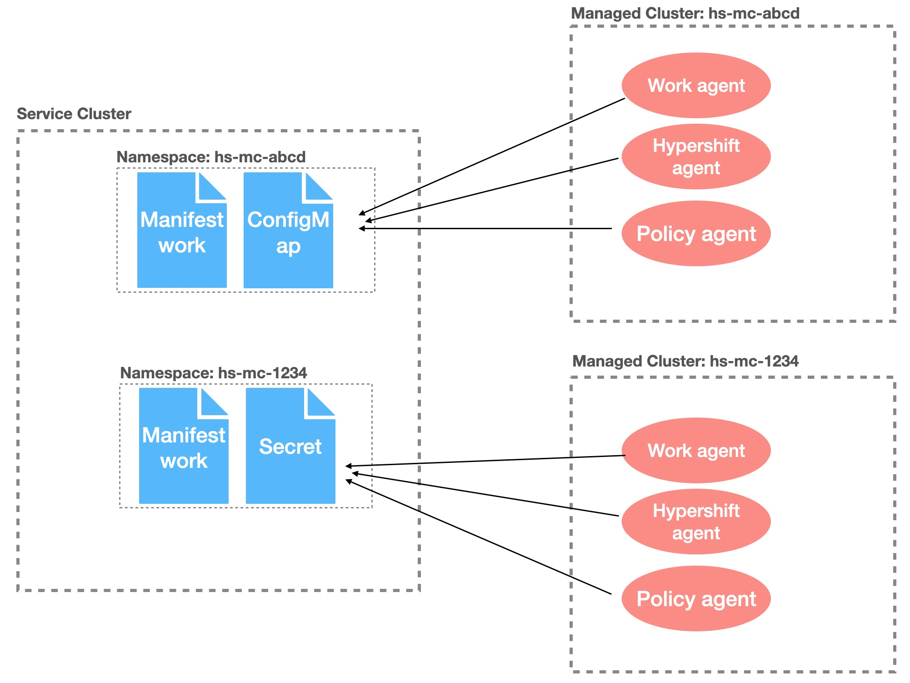
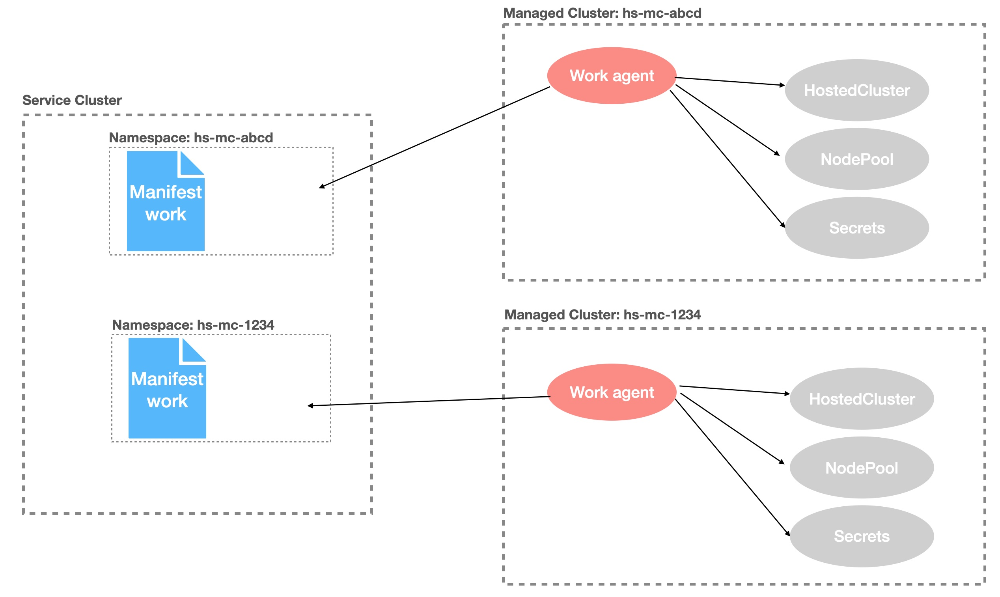

## Service and Management Clusters in ACM Context

ACM is installed on a service cluster. In order for ACM to manage other clusters, the clusters need to be imported into ACM as managed clusters.

Management clusters are imported into the ACM hub cluster to be managed by ACM. By importing management clusters, ACM installs a set of agents on the management clusters to allow ACM to manage the imported cluster through these agents. You can refer to this ACM doc for more details on this. https://access.redhat.com/documentation/en-us/red_hat_advanced_cluster_management_for_kubernetes/2.7/html/clusters/cluster_mce_overview#importing-a-target-managed-cluster-to-the-hub-cluster. These agents run in `open-cluster-management-agent` and `open-cluster-management-agent-addon` namespaces on the management clusters to manage:

- cluster lifecycle
- user applications that are deployed through ACM's application lifecycle feature (not used in ROSA hypershift)
- **cluster governance and policies (policy agents)**
- cluster registrations in ACM
- **handling manifestworks (work agent)**
- **handling hypershift hosted cluster (ACM hypershift agent)**

The three highlighted ACM agents are used by ROSA hypershift for provisioning and managing hypershift hosted clusters. The subsequent sections explain these agents.

On a service cluster, use the following command to list all managed clusters (managedclusters.cluster.open-cluster-management.io) that are imported into the ACM hub cluster.

```
oc get managedcluster
```

**Note:** This will list not only the management clusters but also all other hosted clusters. Typically the management cluster names start with `hs-mc-`. `local-cluster` is ACM's default managed cluster and it is the service cluster or the ACM hub cluster itself. `local-cluster` just like any other remote managed cluster has the ACM agents running in `open-cluster-management-agent` and `open-cluster-management-agent-addon` namespaces. However, `local-cluster` is not used or does not host any hypershift hosted clusters in ROSA hypershift.

A management cluster has its own namespace on the service cluster and the namespace name is the same as the name of the management cluster. The ACM agents running on the management cluster has access to certain resources in this namespace on the service cluster. ACM hub uses this namespace like a mailbox to notify the management cluster's agents that something needs to be done.




## Work Agent

The Cluster Service interfaces a service cluster to orchestrate a hosted cluster provisioning but the hosted cluster is actually created on one of the management clusters that are associated with the service cluster. This is possible because the Cluster Service uses ACM's manifestworks.work.open-cluster-management.io API (https://open-cluster-management.io/concepts/manifestwork/) to deliver kubernetes resources such as HostedClusters, NodePools, Namespaces and Secrets to one of the management clusters so that the hosted cluster gets created on the selected management cluster. As mentioned in the previous section, the work agent running on the management cluster watches `manifestworks.work.open-cluster-management.io` resources placed in the management cluster's namespace on the service cluster and reconcile any changes. As the work agent applies the payload of `manifestworks.work.open-cluster-management.io` resources, it writes the resource status back to the manifestworks located on the service cluster. The cluster service uses this manifestwork's status reporting to determine whether all resources are applied successfully on the management cluster and progress of the hosted cluster provisioning. Look [here](https://github.com/stolostron/hypershift-addon-operator/blob/main/docs/advanced/provision_hypershift_clusters_by_manifestwork.md) for an example manifestwork to provision a hosted cluster. One or more payload resources are listed under `workload.manifests` in the manifestwork resource. 



### Troubleshooting

There are several places where you can check for troubleshooting. On the service cluster, look at the status section of the manifestwork in the management cluster's namespace. The manifestwork resource name should be the cluster ID. This manifestwork contains most of resources required to provision a hosted cluster on the management cluster. Like HostedCluster, Nodepool.. etc. The status section should contain any error about applying the payload resources.

The work agent runs in `klusterlet-work-agent` pods in `open-cluster-management-agent` namespace and `klusterlet-addon-workmgr` pod in `open-cluster-management-agent-addon` namespace on the management cluster. The pod logs should contain logs about creating, applying or deleting the manifestwork payload resources.

If all manifestwork resources are created, applied or deleted successfully, then the work agent's job is done and the hypershift operator reconciles to provision, update or de-provision a hosted cluster.

## ACM HyperShift addon

As explained in the previous section, the ACM work agent applies the resources that make up a hosted cluster and the hypershift operator provisions a hosted cluster based on the resources applied by the work agent. Hypershift hosted cluster is essentially a OpenShift cluster from an end-user perspective. You have multiple management clusters hosting these hosted clusters. If these hosted clusters are imported into ACM hub, you can manage these clusters centrally through the ACM hub. This is where ACM HyperShift addon plays its role. When the Cluster Service creates manifestwork to provision a hosted cluster, it also creates a ManagedCluster CR on the service cluster to get the hosted cluster imported automatically into ACM hub. When the hosted cluster's API server is ready, the HyperShift addon copies the hosted cluster's kubeconfig into a special namespace `klusterlet-{cluster_ID}` to complete the cluster auto-import.

Another thing that this addon agent does is to generate data about number of hosted clusters on the management cluster and report it back to the service cluster so that components like Cluster Service and Fleet Manager can determine where to place the next hosted cluster to even out the load among management clusters and when to scale out a new management cluster. The addon agent generates `AddOnPlacementScore` ACM resource in the management cluster namespace on the service cluster and this resource contains the current number of hosted clusters `status.scores.hostedClustersCount`.

```yaml
apiVersion: cluster.open-cluster-management.io/v1alpha1
kind: AddOnPlacementScore
metadata:
  creationTimestamp: "2022-11-28T19:35:56Z"
  generation: 1
  name: hosted-clusters-score
  namespace: local-cluster
  resourceVersion: "562117"
  uid: cf1a7e80-6e16-4c39-beab-1d6beb0a4475
status:
  conditions:
  - lastTransitionTime: "2022-11-28T19:36:00Z"
    message: Hosted cluster count was updated successfully
    reason: HostedClusterCountUpdated
    status: "True"
    type: HostedClusterCountUpdated
  scores:
  - name: hostedClustersCount
    value: 2
```

The agent also generates `ClusterClaim` ACM resources on the management cluster named `above.threshold.hostedclustercount.hypershift.openshift.io`, `full.hostedclustercount.hypershift.openshift.io` and `zero.hostedclustercount.hypershift.openshift`.io`. See [ClusterClaim](https://open-cluster-management.io/concepts/clusterclaim/) for more general information on cluster claims and see https://github.com/stolostron/hypershift-addon-operator/blob/main/docs/advanced/scheduling_hosted_cluster.md for more information on `AddOnPlacementScore` and `ClusterClaim` resources that this addon agent generates.

`above.threshold.hostedclustercount.hypershift.openshift.io` indicates whether the number of hosted clusters on the management cluster exceeds the threshold number which is 60.

```yaml
apiVersion: cluster.open-cluster-management.io/v1alpha1
kind: ClusterClaim
metadata:
  creationTimestamp: "2023-05-11T15:30:30Z"
  generation: 1
  labels:
    velero.io/exclude-from-backup: "true"
  name: above.threshold.hostedclustercount.hypershift.openshift.io
  resourceVersion: "51261"
  uid: 095b7fa1-afcd-4bc9-9b52-0aa59501592f
spec:
  value: "false"
```

`full.hostedclustercount.hypershift.openshift.io` indicates whether the number of hosted clusters on the management cluster has reached the max number which is 80.

```yaml
apiVersion: cluster.open-cluster-management.io/v1alpha1
kind: ClusterClaim
metadata:
  creationTimestamp: "2023-05-11T15:30:30Z"
  generation: 1
  labels:
    velero.io/exclude-from-backup: "true"
  name: full.hostedclustercount.hypershift.openshift.io
  resourceVersion: "51259"
  uid: 404bff37-e758-4374-9889-379daafe1c43
spec:
  value: "false"
```

`zero.hostedclustercount.hypershift.openshift` indicates whether the number of hosted clusters on the management cluster has no hosted cluster.

```yaml
apiVersion: cluster.open-cluster-management.io/v1alpha1
kind: ClusterClaim
metadata:
  creationTimestamp: "2023-05-11T15:30:30Z"
  generation: 2
  labels:
    velero.io/exclude-from-backup: "true"
  name: zero.hostedclustercount.hypershift.openshift.io
  resourceVersion: "53807"
  uid: 3688249e-6859-4186-a411-68400e0d94d5
spec:
  value: "false"
```

These ACM klusterlet registration agent running in `kluterlet` and `klusterlet-registration-agent` 


### Troubleshooting

On the service cluster, run `oc get managedcluster` command to see the status of managed clusters. Let's assume your hosted cluster name is `rj-0511a`. If this hosted cluster is imported into ACM hub successfully, you will see the output like this.

```
$ oc get managedcluster

NAME            HUB ACCEPTED   MANAGED CLUSTER URLS                                                                         JOINED   AVAILABLE   AGE
rj-0511a        true           https://acc04023ff82546b3b3192e0aa600324-dc7ec0dca3325bac.elb.us-west-1.amazonaws.com:6443   True     True        2d23h
```

The HyperShift addon agent runs in `hypershift-addon-agent` container in `hypershift-addon-agent` pod in `open-cluster-management-agent-addon` namespace on the management cluster. If the managed cluster status is different than this, you should first see the HyperShift addon agent pod log to see if there is any problem copying the hosted cluster's kubeconfig secret into the `klusterlet-{cluster_ID}` namespace. 

If there are problems with the date in `AddOnPlacementScore` and `ClusterClaim` resources mentioned above, look at the agent container logs as well.


## ACM managed cluster addon agents in a hosted cluster

Just like a management cluster, a hosted cluster is also a managed cluster that is managed by ACM. Therefore, there must be a minimum set of ACM agents running in the hosted cluster. These agents typically run on the worker nodes of the ACM managed cluster but for ROSA HyperShift hosted cluster, ACM is configured differently to run these agents along with the hosted control plane in the hosting management cluster. See [here](https://github.com/stolostron/hypershift-addon-operator/blob/main/docs/advanced/running_mce_acm_addons_hostedmode.md) for how ACM is configured to run the agents "hosted mode" for a hosted cluster.

